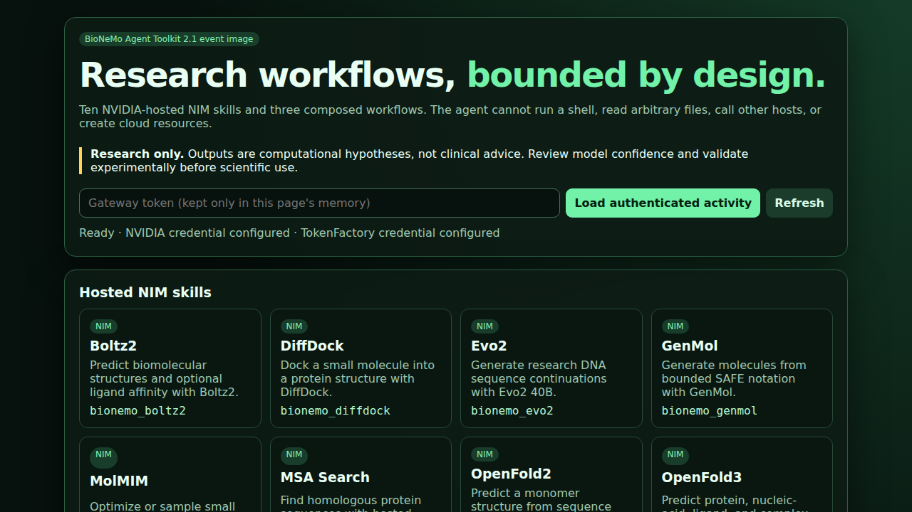

# BioNeMo Agent Toolkit 2.1 on Nebius Serverless

This recipe builds one CPU application image that opens an authenticated
OpenClaw browser agent, uses Nebius TokenFactory for agent reasoning, and calls
ten NVIDIA-hosted BioNeMo NIM APIs through bounded tools. It also exposes the
three composed workflows from the pinned NVIDIA toolkit. Each event participant
deploys a dedicated Serverless Endpoint in their own Nebius project and injects
their own credentials from MysteryBox.

The image does **not** contain NIM containers, model weights, NVIDIA credentials,
TokenFactory credentials, a Docker daemon, a cloud CLI, or a general-purpose
shell tool. It does not create Nebius resources from the browser. Model requests
go to `https://health.api.nvidia.com`; the operator creates and removes the CPU
endpoint with the commands in this runbook.

All examples are nonclinical and research-only. Use only public, synthetic, or
explicitly approved inputs. Structure, docking, sequence, affinity, and design
outputs are computational hypotheses that require expert review and experimental
or wet-lab validation.



## Architecture and trust boundaries

```text
participant browser (HTTPS, gateway token)
            |
            v
 supervised cloudflared quick tunnel          direct Serverless IP (token auth)
            |                                              |
            +----------------------+-----------------------+
                                   v
                      OpenClaw gateway + Control UI
                      TokenFactory: agent reasoning
                                   |
                      exactly 13 typed bionemo_* tools
                                   |
                 fixed https://health.api.nvidia.com routes
                                   |
              generated artifacts under /workspace/artifacts
```

The public dashboard shell contains only a static skill catalog. Request status
and artifact downloads live under `/plugins/bionemo/api/*` and require the
gateway bearer token. The token is held only in page memory, never placed in a
URL or browser storage. OpenClaw's `/healthz` and `/readyz` are public liveness
and process-readiness responses; `/plugins/bionemo/readiness` returns only
credential-presence booleans and artifact-workspace readiness.

OpenClaw uses `tools.profile: minimal` plus the 13 exact tool names. Runtime,
filesystem, network, browser, automation, session, node, agent, messaging, and
media groups are denied. Exec is independently set to `mode: deny`, the host
approval file sets `security: deny` and `autoAllowSkills: false`, elevated mode
is disabled, and the browser operator terminal is disabled. NIM adapters:

- build only fixed HTTPS URLs on `health.api.nvidia.com` and reject redirects;
- reject unknown fields and validate request types, enums, sequence/PDB sizes,
  event fan-out, and scientific request ranges;
- use bounded timeouts, at most two retries for transient vendor failures, and
  a 20 MB streamed response limit;
- strip DiffDock receptors to PDB `ATOM` records;
- redact credentials from errors, manifests, tool output, and logs;
- generate filenames internally and serve only regular files under the
  dedicated artifact root; arbitrary paths and symlinks are rejected.

## Immutable pins

| Component | Pin |
|---|---|
| NVIDIA BioNeMo Agent Toolkit | commit `38a63ada35f57770fe49e633d3461d4110746b26` (2026-08-04) |
| OpenClaw release | `v2026.7.1-2`, commit `0790d9f593ad30c940ed93b5872a8cf6d6f3cf8c` |
| OpenClaw base image | `ghcr.io/openclaw/openclaw:2026.7.1-2@sha256:8789721d2e9b24b780a1504b56deb4c6bd5c7dbf96a1dd117e7c45c2ed72c8ac` |
| Cloudflare tunnel client | `2026.7.3`, Linux amd64 SHA-256 `9d71c677db00134c1bd4144b7783486b654ad281b1ea62b4972098d19f770f17` |
| Agent model | `tokenfactory/zai-org/GLM-5.1` |
| TokenFactory API | `https://api.tokenfactory.nebius.com/v1`, OpenAI chat-completions protocol |
| Application/plugin | `2.1.0`, Node runtime supplied by the pinned OpenClaw image |

The selected toolkit commit was the requested minimum baseline and remained the
upstream `main` HEAD at implementation time. The exact upstream NIM skills,
evaluation assets, workflow documentation, licenses, and notice are vendored in
`vendor/bionemo-agent-toolkit`. Browser-visible skills are safe hosted-only
wrappers; they do not expose the upstream shell or local-Docker instructions.
The four vendored PDB fixtures have only trailing blank columns removed, and
the CC license has only its extra terminal blank line removed, so repository
whitespace checks pass; molecule/structure records and license text are intact.

## Supported hosted NIMs and workflows

| Browser skill | Typed tool | Fixed hosted path |
|---|---|---|
| Boltz2 | `bionemo_boltz2` | `/v1/biology/mit/boltz2/predict` |
| DiffDock | `bionemo_diffdock` | `/v1/biology/mit/diffdock` |
| Evo2 40B | `bionemo_evo2` | `/v1/biology/arc/evo2-40b/generate` |
| GenMol | `bionemo_genmol` | `/v1/biology/nvidia/genmol/generate` |
| MolMIM | `bionemo_molmim` | `/v1/biology/nvidia/molmim/generate` |
| MSA Search | `bionemo_msa_search` | `/v1/biology/colabfold/msa-search/predict` or fixed `/paired/predict` |
| OpenFold2 | `bionemo_openfold2` | `/v1/biology/openfold/openfold2/predict-structure-from-msa-and-template` |
| OpenFold3 | `bionemo_openfold3` | `/v1/biology/openfold/openfold3/predict` |
| ProteinMPNN | `bionemo_proteinmpnn` | `/v1/biology/ipd/proteinmpnn/predict` |
| RFdiffusion | `bionemo_rfdiffusion` | `/v1/biology/ipd/rfdiffusion/generate` |

The composed tools are:

- `bionemo_drug_discovery`: GenMol → DiffDock → Boltz2, capped at 20 generated,
  5 docked, and 3 affinity-scored molecules (event defaults are 8/3/2).
- `bionemo_msa_to_structure`: MSA Search → OpenFold3, capped at 500 alignment
  sequences and one structure-prediction input.
- `bionemo_protein_binder_design`: one RFdiffusion backbone → four
  ProteinMPNN sequences → one OpenFold3 or Boltz2 co-fold. This bounded demo
  does not prove binding or replace full self-consistency/control analysis.

The image includes one fixed public `egfr_kinase_public` sample from the pinned
upstream toolkit. It can be selected for DiffDock, ProteinMPNN, RFdiffusion,
drug discovery, or binder design without pasting a PDB or supplying a path. No
arbitrary asset name or file path is accepted.

## Prerequisites

Each participant needs:

1. A Nebius project and CLI profile with permission to read MysteryBox secrets,
   pull from the chosen Container Registry, and create/read/start/stop/delete
   Serverless Endpoints plus view their logs.
2. Serverless CPU quota for the selected platform/preset and a subnet with
   outbound HTTPS access to TokenFactory, NVIDIA hosted APIs, GitHub only at
   image build time, and `trycloudflare.com` when the bundled tunnel is used.
3. An NVIDIA API key with entitlement to every NIM they plan to demonstrate.
   A key can be syntactically valid while individual hosted NIMs remain
   unentitled or unavailable; the UI reports that without substituting a model.
4. A Nebius TokenFactory key that can use `zai-org/GLM-5.1`.
5. A random gateway token of at least 24 characters. Use 32+ random bytes for
   an event participant.
6. Docker, `crane`, `syft`, `grype`, and `trivy` on the image-publishing
   workstation.

The endpoint is a regular (non-preemptible) CPU endpoint by default for event
stability: platform `cpu-d3`, preset `4vcpu-16gb`, 30 GiB disk, container port
`18789`. Override the platform/preset only after checking current project
availability.

## MysteryBox payloads

Create three secret versions. The selectors can be a secret name, secret ID,
version ID, or `SECRET_ID@VERSION_ID` as accepted by the Nebius CLI.

| Selector variable | Required payload key | Value |
|---|---|---|
| `AUTH_TOKEN_SECRET` | `AUTH_TOKEN` | participant's random browser/endpoint token |
| `NEBIUS_API_KEY_SECRET` | `NEBIUS_API_KEY` | participant's TokenFactory key |
| `NVIDIA_API_KEY_SECRET` | `NVIDIA_API_KEY` | participant's NVIDIA hosted-API key (preferred) |
| `NGC_API_KEY_SECRET` | `NGC_API_KEY` | alternative NVIDIA/NGC key; set this instead of `NVIDIA_API_KEY_SECRET` |

The `AUTH_TOKEN` selector is used twice: Serverless enforces it at the direct
public endpoint, and the container injects it in memory as the OpenClaw gateway
token. The launcher removes the `AUTH_TOKEN` name from the OpenClaw child and
passes `OPENCLAW_GATEWAY_TOKEN`; no secret is written into the generated config
or exec-approval files. Never pass any of these values as plain `--env`, commit
them, paste them into chat, or put the gateway token in a URL.

If the Container Registry is private and the Serverless runtime cannot use
project identity directly, create a fourth MysteryBox version containing
`REGISTRY_USERNAME` and `REGISTRY_PASSWORD`, then export its selector as
`REGISTRY_SECRET`.

## Build, scan, and publish by digest

Build only from the recipe directory on the task branch:

```bash
cd life-science/bionemo-agent
export IMAGE="cr.eu-north1.nebius.cloud/<registry-id>/bionemo-agent:2.1.0"
./scripts/build_image.sh
```

The script pulls the pinned base, builds and pushes the version tag, resolves
the registry digest, writes an SPDX JSON SBOM with Syft, records Docker
provenance metadata, writes a Grype JSON report, and fails on Critical scanner
findings. Evidence is written under `.task-output/image/`. Use only the final
reference printed in `immutable-image.txt`, for example:

```text
cr.eu-north1.nebius.cloud/<registry-id>/bionemo-agent@sha256:<digest>
```

The previous application digest is the rollback target. Before replacing a
participant endpoint, record its current `.status.image`/image field from the
live endpoint object; never infer it from a local tag.

### Published event image (2026-08-05)

The reviewed `2.1.0` event image is published in Nebius Container Registry at:

```text
cr.eu-north1.nebius.cloud/e00jz93pkqx2m4vqj4/models/bionemo-agent@sha256:bdcdb40da80da132df2220120d6dfb23908d5e0870505893613db549134a31cc
```

It was built from cookbook commit
`39aa0581a709e3aff6063a526f75d55a61a80e8b`. The previously absent `2.1.0`
tag means there is no overwritten application digest to use as rollback; for a
new participant endpoint, rollback is deletion. A clean registry export by
digest succeeded, the SPDX SBOM contains the published filesystem inventory,
and the publication scans found zero embedded secrets and zero fixable
Critical findings. See the full unfixed-upstream risk note in [Tests](#tests).

Open the prefilled Nebius Console create page:

[Create a BioNeMo 2.1 Serverless Endpoint](https://console.nebius.com/serverless/endpoint/create?image=cr.eu-north1.nebius.cloud%2Fe00jz93pkqx2m4vqj4%2Fmodels%2Fbionemo-agent%40sha256%3Abdcdb40da80da132df2220120d6dfb23908d5e0870505893613db549134a31cc&platform=cpu-d3&preset=4vcpu-16gb&preemptible=false)

The link fills only supported, non-secret fields. In the Console, keep the
endpoint regular (non-preemptible), expose container port `18789`, enable a
public IP with token authentication, and bind the three MysteryBox payloads
listed above. Do not paste credential values into plain environment fields.

### Serverless deployment evidence (2026-08-05)

A real deployment attempt in project `project-e00z6b02t8ddk96c49` exposed two
Serverless control-plane blockers before an instance was allocated:

1. Passing the 137-character immutable image reference was rejected because an
   internally generated Compute label exceeded its 64-character value limit.
   As a bounded workaround, the same manifest was copied to the short,
   digest-derived, never-reused alias
   `cr.eu-north1.nebius.cloud/e00jz93pkqx2m4vqj4/ba:2.1.0-bdcdb40d`.
   The alias is 62 characters and resolves to the exact published digest
   `sha256:bdcdb40da80da132df2220120d6dfb23908d5e0870505893613db549134a31cc`.
2. Two endpoint creates using regular `cpu-d3` / `4vcpu-16gb`, 30 GiB disk,
   subnet `vpcsubnet-e00p701fa30cj5f7wq`, public token authentication, and
   pinned MysteryBox versions both remained `PROVISIONING` with zero instances,
   logs, or public endpoints for approximately 26–28 minutes, then failed with
   Serverless internal error code 13. The retry used only same-project secrets,
   ruling out cross-project secret resolution as the cause.

Support evidence:

| Attempt | Endpoint | Operation | Request | Trace |
|---|---|---|---|---|
| Existing cross-project secret selectors | `aiendpoint-e00vv5mb8wpja955f2` | `opvmapp-e00h7wrkhknksfyzf5` | `5c9e98d6-2a77-43ee-8950-81058af9e98e` | `c5eed8c91d9873dc51b9ccdcb4a13fe5` |
| Same-project version-pinned selectors | `aiendpoint-e00z96sy0k42jrsawt` | `opvmapp-e00tn1nqm864wcyy6w` | `ee3d7133-7630-48fc-9aac-4ace0905f569` | `dd204de24be2392e4679a8f0956a4beb` |

Both failed endpoints and the two temporary same-project credential aliases
were deleted after evidence capture; the original MysteryBox secrets were not
modified. No browser URL was produced. Do not claim a successful Serverless
deployment until Nebius resolves the internal error and a fresh task-owned
endpoint passes readiness, authenticated browser access, and the live NIM
matrix.

## Create one participant endpoint

```bash
cd life-science/bionemo-agent
export PROFILE=sandbox
export IMAGE="cr.eu-north1.nebius.cloud/<registry-id>/bionemo-agent@sha256:<digest>"
export AUTH_TOKEN_SECRET="<selector-with-AUTH_TOKEN>"
export NEBIUS_API_KEY_SECRET="<selector-with-NEBIUS_API_KEY>"
export NVIDIA_API_KEY_SECRET="<selector-with-NVIDIA_API_KEY>"
# Or, instead of NVIDIA_API_KEY_SECRET:
# export NGC_API_KEY_SECRET="<selector-with-NGC_API_KEY>"
export ENDPOINT_NAME="bionemo-agent-${USER}-event"

# Set these when the profile does not provide one unambiguous project/subnet.
export PARENT_ID="<participant-project-id>"
export SUBNET_ID="<participant-subnet-id>"

# Optional for a private registry:
# export REGISTRY_SECRET="<selector-with-REGISTRY_USERNAME-and-REGISTRY_PASSWORD>"

./scripts/run_serverless_endpoint.sh
```

The agent never sees this command and cannot run it. The script requires an
immutable image and MysteryBox selectors; it rejects plaintext-secret fallback.

Get the endpoint ID and follow startup:

```bash
export ENDPOINT_ID="$(nebius --profile "$PROFILE" ai endpoint get-by-name \
  --name "$ENDPOINT_NAME" --format jsonpath='{.metadata.id}')"
nebius --profile "$PROFILE" ai endpoint get "$ENDPOINT_ID" --format json
nebius --profile "$PROFILE" ai endpoint logs "$ENDPOINT_ID" \
  --tail 200 --timestamps --follow
```

Wait for a log line like:

```text
BioNeMo authenticated HTTPS browser URL: https://<random>.trycloudflare.com
```

The URL contains no credential. Open it on a clean participant machine, paste
the participant's `AUTH_TOKEN` into the OpenClaw login, and connect. Open the
**BioNeMo** tab to see all ten skills, the three workflows, request status, safe
vendor errors, and artifact downloads. The tab asks for the token separately
for protected status/download requests and keeps it only in that page's memory.

The quick tunnel is supervised by the launcher: if it exits, the gateway stops
instead of silently leaving the participant on an unmonitored transport path.
Quick tunnels are best-effort and route public/synthetic demo data through
Cloudflare. For a production or long-running event, put an approved managed
HTTPS ingress in front of the endpoint, set its exact origin with
`BIONEMO_PUBLIC_ORIGIN=https://agent.example`, and set
`BIONEMO_ENABLE_HTTPS_TUNNEL=false`; do not enable OpenClaw's dangerous Host
header fallback or insecure-auth flags.

## Health and direct API checks

From the HTTPS URL:

```bash
curl -fsS "${BROWSER_URL}/healthz"
curl -fsS "${BROWSER_URL}/readyz"
curl -fsS "${BROWSER_URL}/plugins/bionemo/readiness"
curl -fsS -H "Authorization: Bearer ${AUTH_TOKEN}" \
  "${BROWSER_URL}/plugins/bionemo/api/status" | jq
```

`/plugins/bionemo/readiness` returns `503` if any of the three runtime
credentials is absent or the artifact root is not writable. It returns only
booleans, never values. The direct Serverless endpoint also requires its outer
bearer token:

```bash
curl -fsS -H "Authorization: Bearer ${AUTH_TOKEN}" \
  "http://${ENDPOINT_IP}:18789/healthz"
```

Do not use `curl -v`, shell tracing, or commands that print environment values
while credentials are loaded.

## Browser demo prompts

Use these small public/synthetic requests. Before a multi-call workflow, the
agent should summarize the fan-out and ask for confirmation.

1. **Boltz2**

   > Using Boltz2, predict one mmCIF structure for public crambin sequence `TTCCPSIVARSNFNVCRLPGTPEAICATYTGCIIIPGATCPGDYAN`. Use one diffusion sample, then explain returned confidence and link the artifacts. Research only.

2. **DiffDock**

   > Dock ethanol (`CCO`) to the built-in `egfr_kinase_public` receptor with DiffDock. Request one pose, no trajectory, explain that docking confidence is not affinity, and link the SDF.

3. **Evo2**

   > Continue synthetic DNA `ACGTACGTACGTACGT` by 16 tokens with Evo2, seed 7, temperature 0.7, top-k 4. Save FASTA and explain biosafety and validation limits.

4. **GenMol**

   > Generate two unique research molecules from SAFE notation `[*{5-10}]` with GenMol, QED scoring, temperature and noise `1.0`. Link SMI/JSON and do not imply efficacy.

5. **MolMIM**

   > Run a two-molecule, two-iteration MolMIM CMA-ES QED optimization from benzene `c1ccccc1`, with two particles and radius 1. Link outputs and explain property-score limits.

6. **MSA Search**

   > Search UniRef30 for public crambin sequence `TTCCPSIVARSNFNVCRLPGTPEAICATYTGCIIIPGATCPGDYAN`, cap the MSA at 20 sequences, request A3M, report depth, and link it.

7. **OpenFold2**

   > Predict public crambin with OpenFold2 using model 1, no relaxation. Return PDB/mmCIF and confidence caveats.

8. **OpenFold3**

   > Predict one PDB structure for public crambin with OpenFold3 and one diffusion sample. If the hosted route is unavailable, report that exactly without using another model.

9. **ProteinMPNN**

   > Use ProteinMPNN on built-in `egfr_kinase_public`, redesign chain A, return one sequence at sampling temperature 0.1 with seed 7, exclude native/WT from score pairing, and link FASTA.

10. **RFdiffusion**

    > Using built-in `egfr_kinase_public`, run an RFdiffusion research backbone request with contig `A672-995/0 20-20`, 5 diffusion steps, and seed 7. Link PDB and explain the ProteinMPNN/validation handoff.

11. **Drug discovery workflow**

    > After confirming the fan-out, run the drug-discovery workflow on built-in `egfr_kinase_public` from SAFE `[*{5-10}]`: generate 2, dock 1, affinity-score 1. Show GenMol → DiffDock → Boltz2 progress and link every artifact.

12. **MSA-to-structure workflow**

    > Run the MSA-to-structure workflow for public crambin, cap MSA depth at 20, request PDB, show MSA Search → OpenFold3 progress, and explain confidence limits.

13. **Protein-binder-design workflow**

    > This is a legitimate non-pathogen research demo. After asking me to confirm the cost and target, run one binder workflow against built-in `egfr_kinase_public` with contig `A672-995/0 20-20`, binder chain B, sampling temperature 0.1, and OpenFold3 validation. Explain that it is not proof of binding and link every artifact.

OpenFold3 and other hosted routes can be entitlement- or availability-sensitive.
An `unavailable` result is a valid event outcome when backed by the safe error;
do not describe it as successful and do not substitute a different NIM.

## Artifact handling

Every atomic call writes a redacted `response.json` plus detected scientific
artifacts. Workflows prefix step artifacts and add `workflow-summary.json`.
Supported downloads include mmCIF/CIF, PDB, SDF, JSON, A3M, FASTA, and SMI.
Run manifests record timestamps, step state, response keys, byte counts, and
safe error categories—not prompts or credentials. Data remains on the endpoint's
ephemeral/local application disk unless the participant downloads it. Deleting
the endpoint removes that task-owned runtime; download required artifacts first.

## Expected time and cost envelope

These are planning bounds, not performance claims. Measure them in the target
project before the event:

- First endpoint start includes image pull and should be budgeted at 2–10
  minutes; warm process restarts are commonly tens of seconds. Capacity,
  registry locality, and Serverless behavior can change this.
- Small generation/docking calls may finish in seconds to a few minutes.
  MSA Search, OpenFold, RFdiffusion, and composed workflows can take several
  minutes and are bounded by 10–15 minute per-call adapter timeouts.
- The regular CPU endpoint is billed by Nebius for its lifetime. Hosted NIM API
  usage, quota, credits, and billing are controlled by the participant's current
  NVIDIA account/entitlements. Check the NVIDIA account before the event; this
  runbook intentionally does not claim a fixed price.
- The 2/1/1 and single-backbone prompts minimize vendor calls. Do not expand
  fan-out during a shared event without explicit participant approval.

Record observed cold start, per-step timing, NVIDIA request ID, endpoint CPU
platform/preset, region, image digest, and cleanup time in the event evidence.

## Tests

Unit/integration/security coverage uses Node's built-in test runner:

```bash
npm test
git diff --check
```

It covers all ten validators and adapters, exact host/routes, redirects,
request/response limits, retries and vendor errors, secret redaction, artifact
path/symlink isolation, all three workflow handoffs, plugin/manifest tool
parity, browser CSP/auth route posture, config pins, MysteryBox launcher config,
and deny-mode execution controls.

Real hosted validation is explicit and never falls back to mocks:

```bash
export BIONEMO_RUN_LIVE=1
export NVIDIA_API_KEY="<load securely; do not print>"
npm run test:live
```

The live suite attempts all ten NIMs even if one route fails, then all three
workflows, and writes non-secret timings, request summaries, response shapes,
request IDs, and artifact metadata under `.task-output/live-nims/`. An
authentication, entitlement, quota, or permission failure must be fixed by the
participant; do not switch credentials, accounts, projects, models, or regions.

Container checks:

```bash
hadolint Dockerfile
docker build -t bionemo-agent:2.1.0-test .
trivy image --severity HIGH,CRITICAL bionemo-agent:2.1.0-test
```

The publication script emits SPDX, Grype, and Trivy reports, scans the whole
image for secrets, and blocks any **fixable** critical finding. Unfixed
findings from the immutable OpenClaw/Debian base remain in the reports instead
of being hidden. On 2026-08-05, the hardened local image had zero secret
findings and zero fixable critical findings; the full reports still contained
37 Grype and 18 Trivy critical matches without an available fix. Treat those as
an explicit upstream-base risk, retain the reports with event evidence, and
rebuild/rescan when the OpenClaw pin changes. The image removes npm, corepack,
and Vitest from runtime and pins the available GnuTLS security revision.

The OpenClaw audit must resolve the gateway token reference when it runs:

```bash
docker exec -e OPENCLAW_GATEWAY_TOKEN="$AUTH_TOKEN" <container> \
  node /app/openclaw.mjs security audit --json
```

The expected summary is zero critical, zero warning, with no open tool groups,
elevated tools, hooks, or browser control. Update checks and automatic runtime
updates are disabled; publish a newly built immutable image to update OpenClaw.

For a local browser smoke test, set all three credentials in the shell without
printing them and run `./scripts/run_local.sh`. It binds only
`127.0.0.1:18789`, disables the external tunnel, uses a read-only root,
capability drop, `no-new-privileges`, and named state/artifact volumes.

## Troubleshooting

- **`not_ready` / NVIDIA false:** verify the selected MysteryBox version has a
  payload key exactly named `NVIDIA_API_KEY` or `NGC_API_KEY`, its matching
  selector variable is set (not both), and the endpoint service account can
  read it.
- **TokenFactory false or chat fails before a tool call:** verify payload key
  `NEBIUS_API_KEY`, TokenFactory access, and model `zai-org/GLM-5.1`.
- **401/403 from a NIM:** the NVIDIA key or that NIM entitlement was rejected.
  Ask the participant to fix it; do not search for another credential.
- **404 / `hosted_route_unavailable`:** the pinned vendor route is unavailable.
  Report it in the UI and event evidence; no model substitution occurs.
- **429:** wait briefly and retry the same bounded request. The adapter retries
  transient failures at most twice.
- **Timeout:** reduce sequence length, pose/sample count, MSA depth, or workflow
  fan-out. The existing request remains recorded as failed.
- **No HTTPS URL:** inspect endpoint egress/DNS and cloudflared logs. Do not add
  the gateway token to a URL or enable insecure OpenClaw origin/auth flags.
- **Browser origin rejected:** restart with the exact approved HTTPS origin in
  `BIONEMO_PUBLIC_ORIGIN`. The launcher writes that origin before OpenClaw starts.
- **Artifact download asks for auth:** enter the gateway token in the BioNeMo
  tab. It is intentionally separate from the parent Control UI connection.
- **Image pull fails:** verify the digest exists and configure `REGISTRY_SECRET`
  with exact `REGISTRY_USERNAME` / `REGISTRY_PASSWORD` payload keys when project
  identity cannot pull it.
- **Multiple subnets:** export the explicit task-owned `SUBNET_ID`; do not pick
  one by guesswork.

## Stop, restart, rollback, and cleanup

Stop when a participant pauses the demo; CPU billing behavior should be checked
against current Serverless terms:

```bash
nebius --profile "$PROFILE" ai endpoint stop "$ENDPOINT_ID"
nebius --profile "$PROFILE" ai endpoint start "$ENDPOINT_ID"
```

After restart, follow logs for the new quick-tunnel URL and verify `/healthz`,
`/readyz`, authenticated status, one small prompt, and an artifact download.
The HTTPS URL changes because the bundled tunnel is ephemeral.

Rollback means create or update a task-owned endpoint using the recorded prior
immutable application digest, then repeat the browser smoke test. Never use a
mutable tag as a rollback record.

Delete the participant endpoint after downloading artifacts:

```bash
nebius --profile "$PROFILE" ai endpoint delete "$ENDPOINT_ID"
nebius --profile "$PROFILE" ai endpoint list --format json | \
  jq -e --arg id "$ENDPOINT_ID" '[.items[]?.metadata.id] | index($id) == null'
```

Delete task-created temporary registry tags/tunnels and revoke or delete
event-only secret versions according to the participant's credential policy.
The Cloudflare process exits with the endpoint; there is no timer, cron job, or
background agent left on the workstation.

## Upstream references

- [NVIDIA BioNeMo Agent Toolkit](https://github.com/NVIDIA-BioNeMo/bionemo-agent-toolkit)
- [Pinned toolkit commit](https://github.com/NVIDIA-BioNeMo/bionemo-agent-toolkit/commit/38a63ada35f57770fe49e633d3461d4110746b26)
- [NVIDIA BioNeMo Agent Toolkit announcement](https://nvidianews.nvidia.com/news/nvidia-launches-bionemo-agent-toolkit-giving-ai-agents-the-tools-to-accelerate-scientific-discovery)
- [OpenClaw release `v2026.7.1-2`](https://github.com/openclaw/openclaw/releases/tag/v2026.7.1-2)
